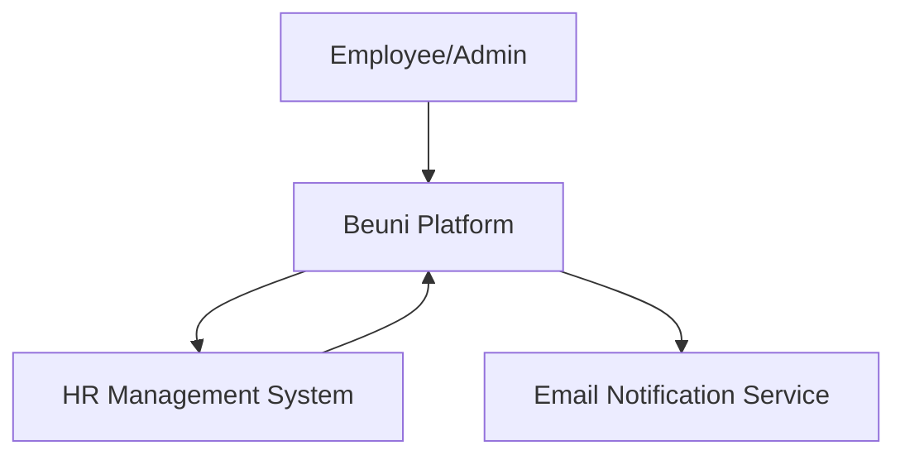
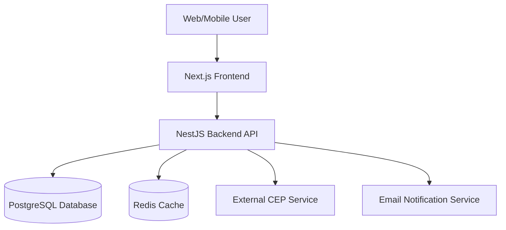
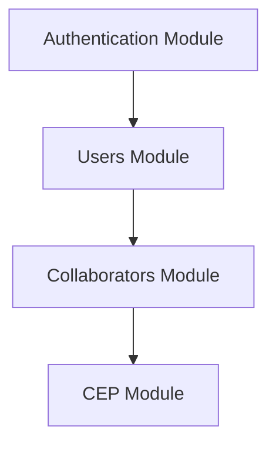

# Beuni - System Architecture

## 🏛️ Architecture Overview

### 📊 C4 Model Diagrams

#### Context Diagram

#### Container Diagram

#### Component Diagram (Backend)

## 🔧 Architectural Decisions

### 🌐 Architecture Style
- **Layered Architecture**
- **Modular Monolith** with clear separation of concerns
- Future potential for microservices migration

### 🛡️ Security Principles
- **Authentication**: JWT with Passport.js
- **Authorization**: Role-based access control
- **Data Protection**: Input validation, sanitization
- **Secure Communication**: HTTPS, CORS configuration

### 🗃️ Data Management
- **ORM**: Prisma for database interactions
- **Caching**: Redis for performance optimization
- **Migrations**: Prisma schema-driven migrations
- **Connection Pooling**: Managed by Prisma

### 🚀 Performance Optimization
- **Caching Layer**: Redis for frequently accessed data
- **Lazy Loading**: Module-level lazy loading in NestJS
- **Pagination**: Implemented for list endpoints
- **Rate Limiting**: Prevent abuse and DoS attacks

### 📡 Integration Strategies
- **External Services**:
  - CEP Validation via external API
  - Potential HR system integration
  - Email notification service

### 🔄 Scalability Considerations
- **Stateless Authentication**
- **Horizontal Scaling Ready**
- **Modular Design for Future Extensions**

## 🛠️ Technology Choices Rationale

### Backend Framework: NestJS
- **Why**: 
  - Opinionated TypeScript framework
  - Dependency Injection
  - Modular architecture
  - Performance optimized
  - Rich ecosystem

### ORM: Prisma
- **Why**:
  - Type-safe database client
  - Automatic migrations
  - Easy schema management
  - Database agnostic

### Authentication: Passport.js + JWT
- **Why**:
  - Flexible authentication
  - Stateless token-based auth
  - Multiple strategy support
  - Secure token management

### Caching: Redis
- **Why**:
  - In-memory data store
  - High performance
  - Support for various data structures
  - Pub/Sub capabilities

## 🚧 Future Roadmap

### Short-Term Goals
- Implement Frontend
- Complete test coverage
- Add monitoring and logging
- Enhance security features

### Long-Term Goals
- Microservices decomposition
- Multi-tenant support
- Advanced analytics
- Machine learning integration for birthday predictions

## 🔒 Compliance and Security

### Standards Adherence
- GDPR data protection principles
- OAuth 2.0 authentication guidelines
- OWASP security recommendations

### Recommended Enhancements
- Implement multi-factor authentication
- Regular security audits
- Automated vulnerability scanning

## 📊 Performance Metrics

### Expected Performance
- **API Response Time**: < 200ms
- **Concurrent Users**: 1000+ 
- **Database Query Performance**: Indexed, optimized queries
- **Cache Hit Rate**: Target 80%

## 🤝 Contribution and Governance

### Architecture Evolution
- Quarterly architecture reviews
- Performance and security assessments
- Continuous refactoring
- Technical debt management

### Decision Log
- All significant architectural decisions documented
- ADR (Architecture Decision Records) maintained
- Transparent change management

## 📚 Further Reading
- [NestJS Documentation](https://nestjs.com)
- [Prisma Documentation](https://www.prisma.io)
- [Redis Best Practices](https://redis.io/docs/best-practices)

