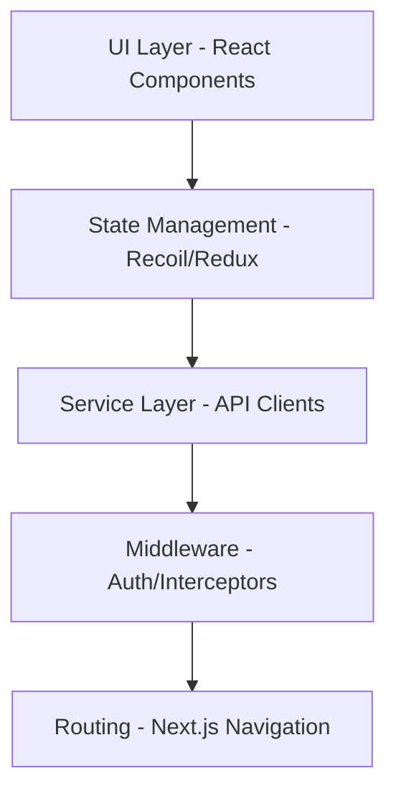
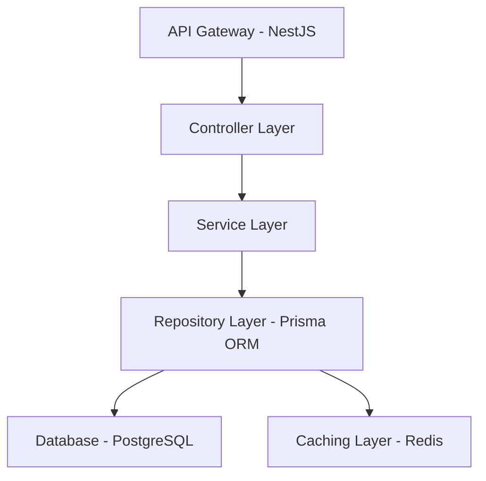
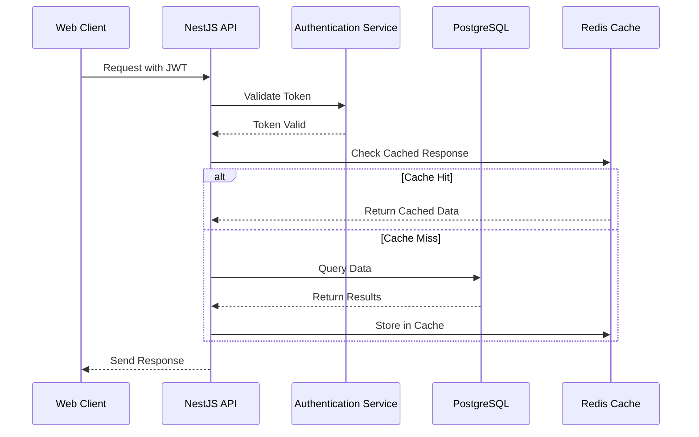

# 🏗️ Beuni Project Architecture

## 🌐 High-Level Architecture Overview

### System Components
- **Frontend**: Next.js 14 + React 18
- **Backend**: NestJS 10 
- **Database**: PostgreSQL 15
- **Caching**: Redis 7
- **Authentication**: JWT + CSRF Protection
- **Containerization**: Docker

### Architectural Principles
- **Multi-Tenancy**: Secure isolation between organizational instances
- **Scalability**: Microservices-ready design
- **Performance**: Optimized data flow and caching
- **Security**: Layered security approach

## 🔍 Component Architecture

### Frontend Architecture

### Backend Architecture

## 🛡️ Security Architecture
- **Authentication Flow**:
  1. JWT Token Generation
  2. httpOnly Cookie Storage
  3. CSRF Token Validation
  4. Role-Based Access Control

- **Data Isolation**:
  - Tenant-specific database schemas
  - Middleware-level tenant filtering
  - Encrypted sensitive data at rest

## 📊 Performance Architecture
- **Caching Strategies**:
  - Redis for session management
  - Query result caching
  - Distributed cache invalidation

- **Optimization Techniques**:
  - Database indexing
  - Query optimization
  - Lazy loading
  - Code splitting

## 🔄 Data Flow

## 🚀 Deployment Architecture
- **Development**: Docker Compose
- **Staging**: Kubernetes Cluster
- **Production**: Multi-Region Cloud Deployment
  - Load Balancing
  - Auto-scaling
  - Disaster Recovery

## 🔬 Technology Choices Rationale

### Why Next.js?
- Server-Side Rendering
- Automatic Code Splitting
- Built-in TypeScript Support
- Optimal Performance

### Why NestJS?
- Modular Architecture
- Dependency Injection
- TypeScript-First
- Enterprise-Grade Scalability

### Why Prisma ORM?
- Type-Safe Database Queries
- Easy Schema Migrations
- Performance Optimization
- Multi-Database Support

## 📈 Future Architecture Roadmap
- Microservices Transition
- Event-Driven Architecture
- Serverless Components
- Enhanced Multi-Tenancy

## 🤝 Architectural Governance
- Quarterly Architecture Reviews
- Performance Benchmark Tracking
- Security Compliance Checks
- Continuous Refactoring