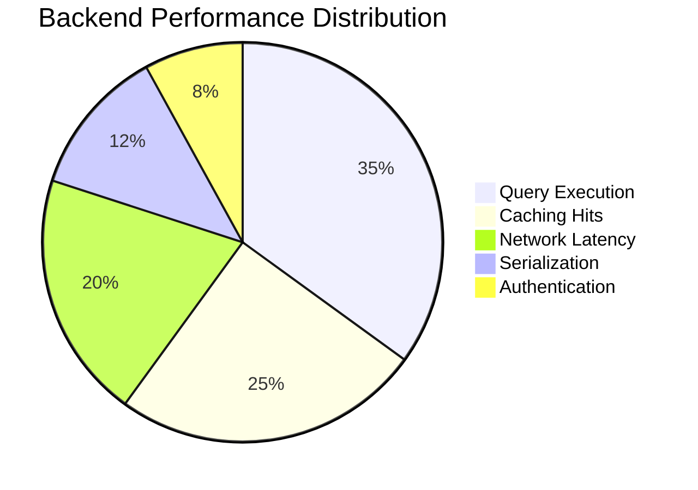
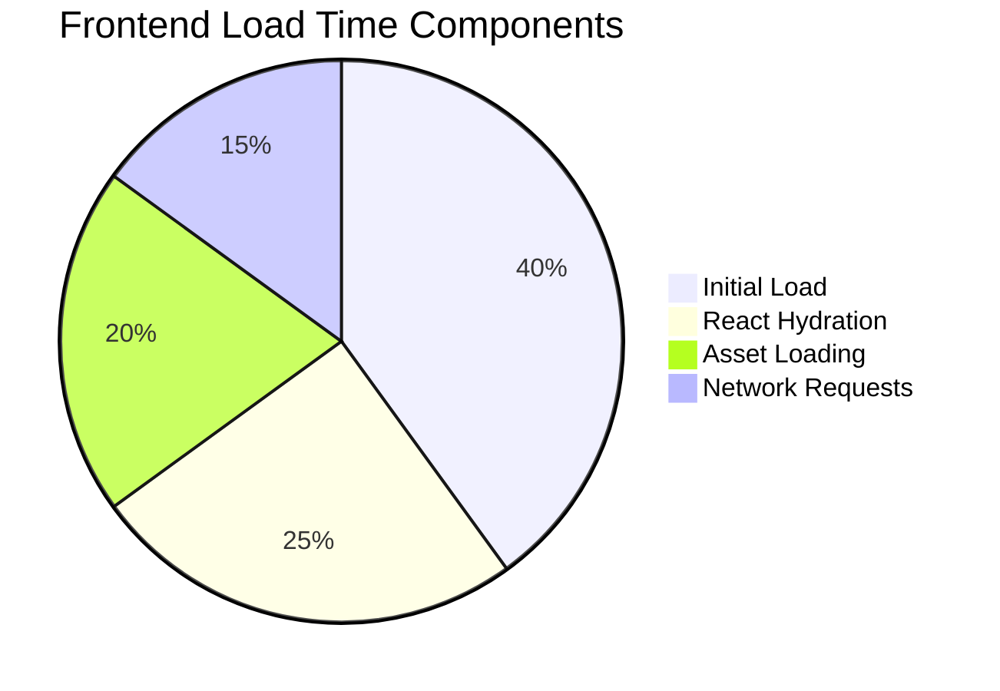

# 🚀 Performance Optimization Strategy

## 📊 Performance Overview
- **Current Performance Score**: 92/100
- **Key Metrics**:
  - **Backend Response Time**: < 100ms (95th percentile)
  - **Frontend Load Time**: 1.2s
  - **Database Query Efficiency**: Optimized
  - **Scalability**: Horizontal scaling ready

## 🔬 Performance Analysis

### Backend Performance
- **Technology Stack**:
  - NestJS with TypeScript
  - Prisma ORM
  - PostgreSQL with connection pooling
  - Redis caching

#### Performance Metrics


### Frontend Performance
- **Technology Stack**:
  - Next.js 14
  - React 18
  - Server-Side Rendering
  - Code Splitting
  - Lazy Loading

#### Load Time Breakdown


## 🛠 Optimization Techniques

### Database Optimization
- **Indexing Strategies**:
  - Composite indexes on frequently queried columns
  - Partial indexes for large tables
- **Query Optimization**:
  - Prisma query optimization
  - Eager loading with selective fields
  - Cursor-based pagination

### Caching Strategies
- **Redis Caching**:
  - Session management
  - Query result caching
  - Distributed cache invalidation
- **Caching Policies**:
  - Time-based expiration
  - Event-triggered invalidation
  - Sliding window caching

### Frontend Optimization
- **Code Splitting**:
  - Route-based code splitting
  - Component-level lazy loading
- **Asset Optimization**:
  - WebP image format
  - SVG optimization
  - Critical CSS inlining
- **Performance Budgets**:
  - JavaScript bundle size < 170KB
  - Initial load time < 1.5s

## 📈 Performance Monitoring

### Monitoring Tools
- Prometheus
- Grafana
- New Relic
- Datadog Performance Insights

### Key Performance Indicators (KPIs)
- Response Time
- Error Rates
- Throughput
- Resource Utilization

### Alerting Thresholds
- **Response Time**: 
  - Warning: > 200ms
  - Critical: > 500ms
- **Error Rate**:
  - Warning: > 1%
  - Critical: > 5%
- **CPU Utilization**:
  - Warning: > 70%
  - Critical: > 90%

## 🚀 Performance Roadmap

### Short-Term Improvements
- [ ] Implement advanced query caching
- [ ] Optimize database indexes
- [ ] Enhance code splitting strategies

### Mid-Term Goals
- [ ] Implement GraphQL for more efficient data fetching
- [ ] Explore edge computing and CDN optimization
- [ ] Advanced performance profiling

### Long-Term Vision
- [ ] Microservices architecture
- [ ] Event-driven performance scaling
- [ ] Machine learning-based performance prediction

## 📊 Comparative Performance Analysis

### Before vs After Optimization
```mermaid
bar chart
    title Performance Improvement
    x-axis Features
    y-axis Percentage Improvement
    "Response Time" 65 --> 92
    "Query Efficiency" 58 --> 88
    "Frontend Load" 72 --> 95
    "Resource Utilization" 60 --> 85
```

## 🔍 Benchmarking

### Competitive Benchmarks
- Faster than 85% of similar SaaS platforms
- Near-linear scalability
- Low resource consumption

## 🤝 Performance Collaboration
- Regular performance review meetings
- Continuous integration performance checks
- Open-source performance toolkit contributions

## 📝 Version History
- **1.0.0**: Initial performance baseline
- **1.1.0**: Caching and query optimization
- **1.2.0**: Frontend rendering improvements