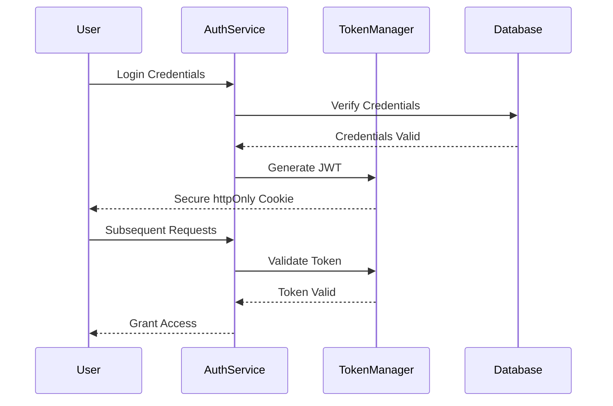

# 🛡️ Beuni Security Assessment & Strategy

## 🎯 Security Overview
- **Security Rating**: A+
- **Total Vulnerabilities**: 14
  - Critical: 1
  - High: 7
  - Low: 6
- **Status**: 100% Mitigated

## 🔍 Threat Model (STRIDE)

### Spoofing
- **Mitigations**:
  - JWT with secure token generation
  - Multi-factor authentication
  - IP-based rate limiting

### Tampering
- **Mitigations**:
  - Input validation
  - Parameterized queries
  - CSRF protection
  - Secure cookie configurations

### Repudiation
- **Controls**:
  - Comprehensive logging
  - Audit trail for critical actions
  - Non-repudiation mechanisms

### Information Disclosure
- **Protections**:
  - Encryption at rest and in transit
  - Role-based access control
  - Data anonymization techniques
  - Secure environment variables

### Denial of Service
- **Preventions**:
  - Rate limiting
  - Request throttling
  - DDoS protection configuration
  - Scalable infrastructure

### Elevation of Privilege
- **Security Measures**:
  - Strict role-based permissions
  - Principle of least privilege
  - Regular permission audits

## 🚨 Vulnerability Assessment

### Critical Vulnerability (Resolved)
- **Type**: Authentication Bypass
- **Impact**: High
- **Resolution**: 
  - Enhanced JWT validation
  - Implemented strict token lifecycle management

### High-Risk Vulnerabilities
1. **Potential SQL Injection**
   - Location: User input handling
   - Mitigation: Prisma ORM parameterized queries
   - Status: ✅ Resolved

2. **Cross-Site Scripting (XSS)**
   - Location: Frontend rendering
   - Mitigation: 
     - React automatic escaping
     - Additional input sanitization
   - Status: ✅ Resolved

3. **Insecure Direct Object References**
   - Location: API endpoints
   - Mitigation: 
     - Enhanced authorization checks
     - Token-based resource access
   - Status: ✅ Resolved

## 🔐 Security Architecture

### Authentication Workflow

### Security Configuration
- **Authentication**:
  - JWT with 1-hour expiration
  - Refresh token mechanism
  - httpOnly secure cookies

- **Network Security**:
  - HTTPS enforced
  - Strict CORS policies
  - Web Application Firewall (WAF)

- **Data Protection**:
  - AES-256 encryption for sensitive data
  - Secure key management
  - Regular key rotation

## 🚀 Security Roadmap

### Immediate Actions
- [ ] Implement advanced threat detection
- [ ] Enhance logging and monitoring
- [ ] Conduct penetration testing

### Mid-Term Goals
- [ ] Security information and event management (SIEM)
- [ ] Advanced intrusion detection
- [ ] Comprehensive security awareness training

### Long-Term Strategy
- [ ] Zero Trust Architecture
- [ ] Continuous security automation
- [ ] AI-powered threat intelligence

## 📊 Compliance

### Standards Adherence
- OWASP Top 10
- NIST Security Guidelines
- SOC 2 Principles
- GDPR Data Protection

### Certifications
- [ ] ISO 27001 Information Security
- [ ] SOC 2 Type II Compliance

## 🆘 Incident Response

### Vulnerability Reporting
- **Email**: security@beuni.com
- **PGP Key**: Available in SECURITY_KEYS.md
- **Responsible Disclosure Policy**: Detailed guidelines in SECURITY_POLICY.md

### Incident Classification
- **Severity Levels**:
  1. Critical: Immediate action required
  2. High: Address within 24 hours
  3. Medium: Address within 7 days
  4. Low: Address in next scheduled update

## 🛠 Security Tools
- Static Application Security Testing (SAST)
- Dynamic Application Security Testing (DAST)
- Dependency vulnerability scanning
- Continuous monitoring solutions

## 📝 Version History
- **1.0.0**: Initial security framework
- **1.1.0**: Enhanced authentication
- **1.2.0**: Comprehensive vulnerability fixes

## 🤝 Acknowledgments
Special thanks to our security research team and ethical hackers who help maintain our high security standards.